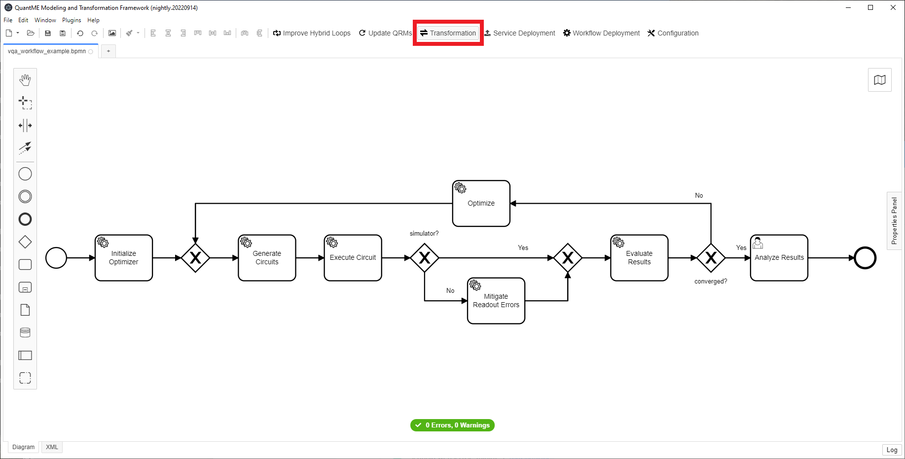

# Quokka
[](https://opensource.org/licenses/Apache-2.0)

Quokka is an ecosystem enabling the service-based execution of quantum algorithms, in particular [Variational Quantum Algorithms (VQAs)](https://www.nature.com/articles/s42254-021-00348-9).
As VQAs are hybrid quantum algorithms comprising many classical and quantum tasks, a variety of services implementing these tasks are required.
Thus, Quokka provides the following functionalities as services via a single Endpoint:
1. [Quantum circuit generation](https://github.com/UST-QuAntiL/quantum-circuit-generator)
2. [Quantum circuit execution](./services/execution-service)
3. [Error mitigation](https://github.com/UST-QuAntiL/error-mitigation-service)
4. [Result analysis and objective evaluation](https://github.com/UST-QuAntiL/objective-function-service)
5. [Optimization](./services/optimization-service)

To integrate all these services and manage the control and data flow, Quokka is best used in combination with workflows.
A tutorial can be found [here](#running-a-workflow-based-quantum-application).

## Running Quokka
The easiest way to get start with quokka is using [Docker-Compose](https://docs.docker.com/compose/): 

1. Clone the repository using ``git clone https://github.com/UST-QuAntiL/Quokka.git``
2. Navigate to the repository and start it by running ``docker-compose up``

Afterwards, Quokka is available at [http://127.0.0.1:6474/](http://127.0.0.1:6474/)


## API Documentation

A description of the API Gateway uniting the Quokka services can be found [here](https://github.com/UST-QuAntiL/Quokka-Gateway).

It contains references to all connected services. 
Their API specifications and examples are available via Swagger at [http://127.0.0.1:SERVICE-PORT/api/swagger-ui](http://127.0.0.1:SERVICE-PORT/api/swagger-ui).


## Running a workflow-based quantum application
Building a workflow-based quantum application is a multi-step process that starts with setting up the necessary tools for modeling the application.

### Setting up the Requisites:
First, get the API gateway and all related services running, thus, start Quokka as described in [**Running Quokka**](#running-quokka)

Next, a modeling tool for suitable for modeling quantum applications is required.
In this example, we use the [QuantME Modeling and Transformation Framework](https://github.com/UST-QuAntiL/QuantME-TransformationFramework).
It uses [Camunda](https://camunda.com) as a BPMN standard-compliant Modeler and implements quantum-specific functionalities defined by [Quantum4BPMN](https://github.com/UST-QuAntiL/QuantME-Quantum4BPMN).

To setup the QuantME Modeling and Transformation Framework by cloning the repository and building the app in a Posix environment (use GitBash or WSL on Windows).
```sh
git clone https://github.com/UST-QuAntiL/QuantME-TransformationFramework.git
cd  QuantME-TransformationFramework

# install dependencies
npm install

# build the application to ./dist
npm run build

# or directly run the application in dev mode
npm run dev
```

Afterwards, the following should be shown:


Open the example workflow available [here](.workflow/workflow/vqa_workflow_example) using the QuantME Modeling and Transformation Framework by clicking on ``File`` in the top left corner and subsequently selecting the file in the ``Open File...`` Dialog.

Next, the repository endpoint for the QuantME replacement models (QRM) must be configured, such that the QuantME specific quantum tasks can be transformed into standard-compliant BPMN tasks before execution.
Thus, click on ``Configuration``, select the ``QRM Data`` tab and insert the values described below:
* ``QRM Data`` tab:
    * ``QRM Repository User``: UST-QuAntiL
    * ``QRM Repository Name``: Quokka
    * ``QRM Repository Path``: workflow/qrms

Note: updating the configuration might require a refresh of the editor. This can be done by opening the console with F12 and then refreshing the editor by pressing F5.


### Transforming and Executing the Quantum Workflow

Before executing the workflow it now has to be transformed into a BPMN standard-compliant workflow.
Thus, click the ``Transformation`` button.
Afterwards, all quantum-specific tasks should have been replaced with standard BPMN elements.


Next, deploy the workflow by clicking the ``Workflow Deployment`` button.
Once it is successfully deployed, open the UI of the Camunda BPMN engine via: ``$PUBLIC_HOSTNAME:8080/camunda``

First, create an account in the Camunda engine and log in. Then, the following screen is displayed:


Click on the home icon in the top-right corner and select ``Tasklist``.

To instantiate the workflow model, select ``Start process`` on the top-right and select the workflow in the pop-up menu.
Next, modify the input options according to your requirements and subsequently press ``Start``.
If the quantum circuits shall be run on a quantum device or use a simulated device noise model, valid IBMQ credentials giving access to the device must be provided.


The UI displays a notification at the bottom-right that the workflow instance was successfully started.

Afterwards, once more click on the home icon on the top-right and select ``Cockpit``.
Click on the ``Running Process Instance``, then select the started workflow, and afterwards click on the workflow ID. 
Now the workflow's token flow, and the changing parameters can be observed. 
To see the current state of the workflow instance refresh the page.


Wait until the token reaches the final user task in the workflow as depicted below. 
This might take some time, depending on the circuit size, the execution parameters, and the utilization of the selected QPU.


Afterwards, switch to the Camunda Tasklist via the home menu and click on ``Add a simple filter`` on the left.
Now, the task object for the human task should be visible in the task list. Click on the task object and then on the ``Claim`` button to get the URL for the plot of the execution result.


Finally, click the ``Complete`` button to finish the human task, and as it is the last activity in the workflow to terminate the workflow instance.

## Disclaimer of Warranty
Unless required by applicable law or agreed to in writing, Licensor provides the Work (and each Contributor provides its Contributions) on an "AS IS" BASIS, WITHOUT WARRANTIES OR CONDITIONS OF ANY KIND, either express or implied, including, without limitation, any warranties or conditions of TITLE, NON-INFRINGEMENT, MERCHANTABILITY, or FITNESS FOR A PARTICULAR PURPOSE. You are solely responsible for determining the appropriateness of using or redistributing the Work and assume any risks associated with Your exercise of permissions under this License.

## Haftungsausschluss
Dies ist ein Forschungsprototyp. Die Haftung für entgangenen Gewinn, Produktionsausfall, Betriebsunterbrechung, entgangene Nutzungen, Verlust von Daten und Informationen, Finanzierungsaufwendungen sowie sonstige Vermögens- und Folgeschäden ist, außer in Fällen von grober Fahrlässigkeit, Vorsatz und Personenschäden, ausgeschlossen.

## Acknowledgements
The initial code contribution has been supported by the project [SEQUOIA](https://www.iaas.uni-stuttgart.de/forschung/projekte/sequoia/) funded by the [Baden-Wuerttemberg Ministry of the Economy, Labour and Housing](https://wm.baden-wuerttemberg.de/).